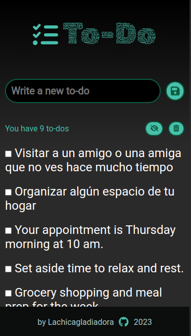
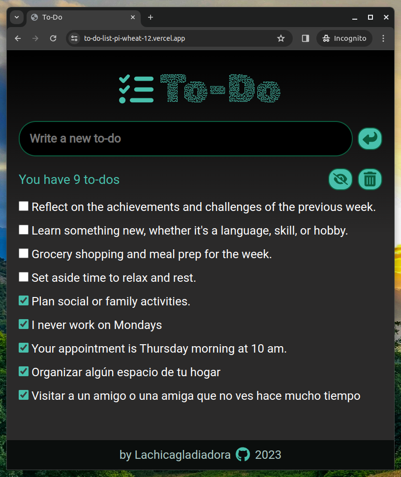
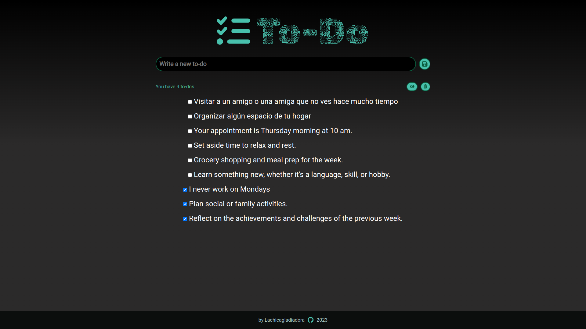

# TO-DO LIST

To-do list with react and typescript, styles with react styles.
This application allows you to create to-dos to mark them once completed, and you can also delete all completed to-dos.
The input is used to create new to-do and also as a search engine as you type.

## Responsive

### Mobile

### Tablet

### Desktop

## How to run

1. Clone this repository.
2. Run `npm install` to install the dependencies.
3. Run `npm run dev` to run the server so you can enjoy the viewing.
